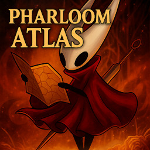

# 🗺️ Pharloom Atlas
*The ultimate Silksong map overhaul — feature-packed, customizable, and crafted for completionists.* 
*Explore. Track. Master Pharloom.*

1. [Overview](#overview)
1. [Core Highlights](#core-highlights)
1. [Installation and Compiling](#installation)
1. [Usage](#usage)
1. [Web Integration](#web-integration)
1. [Developer Notes](#developer-notes)
1. [Contributing, Credits, and License](#contributing-credits-license)
	- [Additional Contributions](#additional-contributions)
	- [Additional Credits](#additional-credits)
---

## 📖️ Overview
**Pharloom Atlas** is a full-featured, map overhaul for *Hollow Knight: Silksong*.
It redefines exploration, tracking, and completion by merging precision mapping, data integration, and community-driven enhancements — all designed for completionists and explorers alike.

Every feature is fully configurable. Whether you want minimalist discovery or full map visibility, Pharloom Atlas adapts to your playstyle.

[See Nexus Mods page for further details.](https://www.nexusmods.com/hollowknightsilksong/mods/755)

Built on top of the **[BepInEx](https://github.com/BepInEx/BepInEx/)** framework.

## ✨️ Core Highlights
- Highly customizable map experience: toggle UI elements, icon categories, and map behaviors.
- Spoiler-safe “reveal” mechanics that let you uncover Pharloom naturally.
- Real-time tracking of icons, pins, and player position.
- Dependency chains for icon accessibility requirements and fulfillment needs.
- Optional mouse, keyboard, and controller support for every interface including map control enhancements.
- Built-in data collection tools for community-sourced completion accuracy.

## ⚙️ Installation
1. Install **[BepInEx](https://www.nexusmods.com/hollowknightsilksong/mods/26)**.
1. [Download](https://www.nexusmods.com/hollowknightsilksong/mods/755?tab=files) and extract this mod into: `Hollow Knight Silksong/BepInEx/plugins/dakusan` 
You should end up with paths like: `Hollow Knight Silksong/BepInEx/plugins/dakusan/PharloomAtlas.dll`
1. (Optional) If you use other *Dakusan* mods — such as [Plugin Developer Tools](https://www.nexusmods.com/hollowknightsilksong/mods/510) or [NoClip](https://www.nexusmods.com/hollowknightsilksong/mods/478) — place them in the same `dakusan` directory.
1. Run the game and enjoy your upgraded map!

## 🔨️ Compiling
* See [root project README](../#compiling) for details

## 🧭️ Usage
- Open the config window in-game with **F1** to toggle/set options.
- 💡️ *Tip: Hide **advanced** and **shortcut** options in configuration window to declutter the UI.*
- Sidebar and map options visible when entering map.
- All features support controller, keyboard, and mouse.
- User interfaces translated [via LLM] into 20 languages.

## 🌐️ Web Integration
Pharloom Atlas can connect to an optional hosted **[Web Server](../WebServer#readme)** to receive player-submitted data — helping crowdsource map accuracy, item markers, and hidden area information.

## 🧩️ Developer Notes
- Source code organized under `PharloomAtlas/`. I tried my best making classes have public interfaces for others reuse.
- Built using shared utilities from [`SilkDev/`](../SilkDev/#readme).

## 🤝🏻 Contributing, Credits, and License
* See [root project README](../#contributing) for details
*  🛠️ Additional Contributions
	* You can help refine icon categorization, improve data mapping, or submit patches.
	* To contribute data, use the **Saved Values Window** in-game and select **Save+Send**.
*  📜️ Additional-Credits
	* Initial icons, structure, and inspiration drawn from community mapping projects like [MapGenie.io](https://mapgenie.io/hollow-knight-silksong/maps/pharloom).
	* All assets © their respective creators (mostly Team Cherry).

